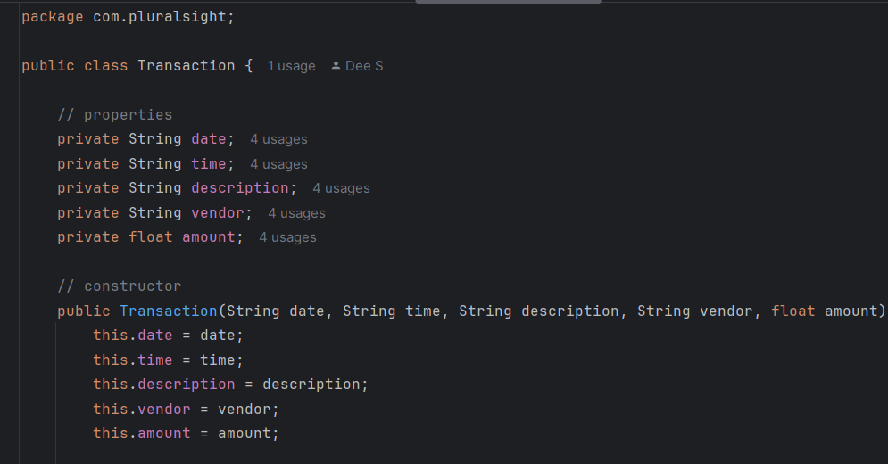
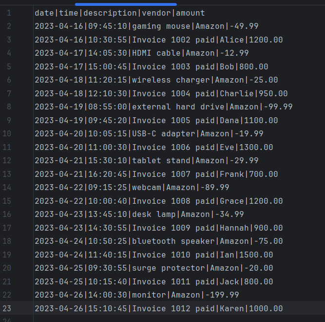
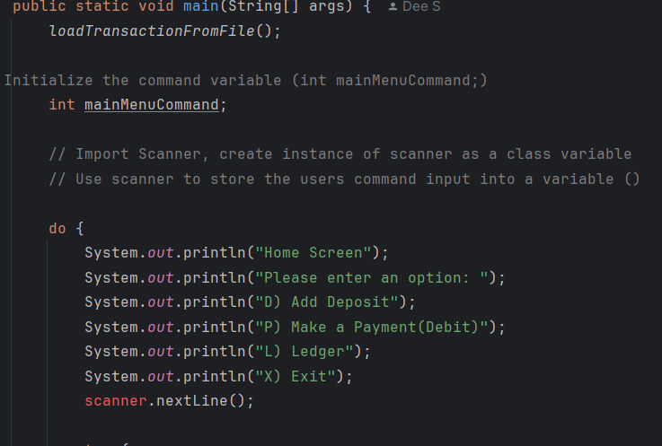
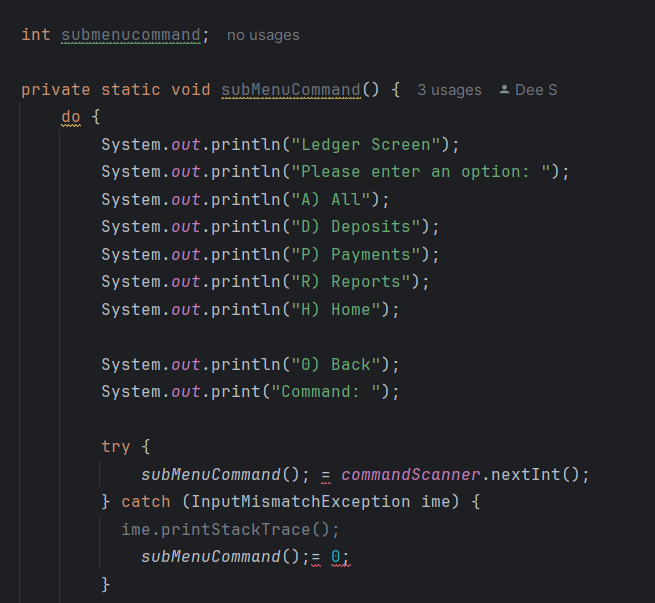
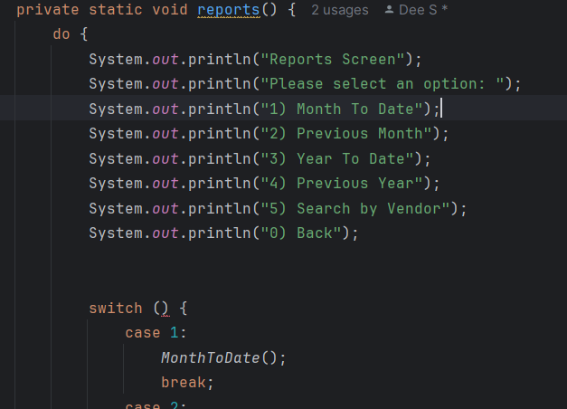

CLI Accounting Ledger Application

// A java CLI app, for managing an accounting ledger. Users can view and add transactions and track income expenses.
//Transactions are tracked by date, time, vendor and amount.
//

//This application works from Intellij IDEA

//Once the program is running, you should see a menu screen asking you about deposits, reports, ledger or to exit.
//Viewing the ledger will display a submenu that will allow you to view deposits, payments and reports.

//Going to Reports wi;; display another submenu will you will be able to search your trans actions by, year, date or month. You can also search by vendor.

